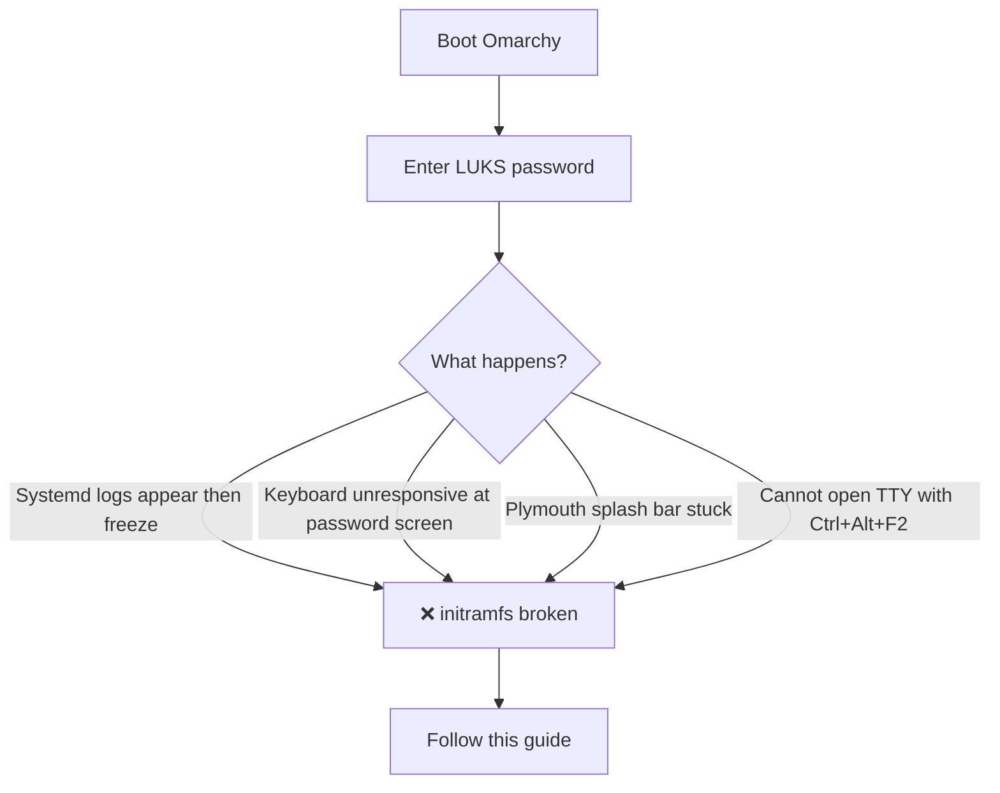
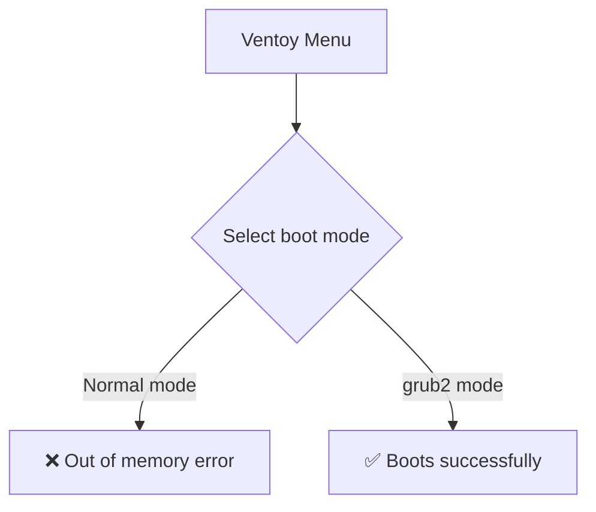
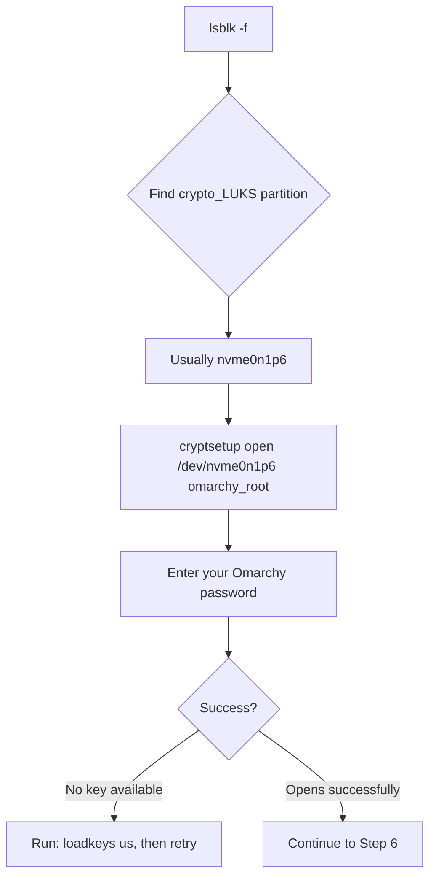
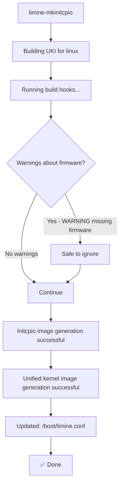

# Fixing Omarchy Stuck at Boot: A Complete Recovery Guide

*Published: March 2026 | Tags: Linux, Arch, Troubleshooting, Recovery*

> **TL;DR:** After a fresh Omarchy install, the system may freeze after the password screen due to a broken `initramfs`. This guide walks you through fixing it via chroot from the Omarchy ISO using Ventoy.

---

## The Problem

After installing Omarchy for the first time, you may encounter this situation:

- You enter your disk encryption password
- The system shows systemd boot logs
- It **freezes** — keyboard stops responding, no TTY access
- Progress bar on the splash screen doesn't move

The root cause is that `mkinitcpio` (the tool that builds the initial RAM filesystem) did not complete successfully during installation. This means the kernel cannot properly initialize hardware (especially keyboard drivers) early in the boot process.

---

## Symptoms



---

## What You Need

- A USB drive with **Ventoy** installed
- The **Omarchy ISO** copied onto the Ventoy USB
- Your Omarchy disk encryption password

---

## Overview


---

## Step-by-Step Guide

### Step 1 — Boot from Ventoy USB

1. Insert your Ventoy USB
2. Restart your computer and boot from USB (usually `F12` or `F11` for boot menu)
3. In the Ventoy menu, select your **Omarchy ISO**
4. When asked for boot mode, select **"Boot in grub2 mode"**

> ⚠️ **Important:** "Boot in normal mode" may fail with an out-of-memory error for large ISOs like Omarchy. Always use grub2 mode.



---

### Step 2 — Open a TTY

Once the Omarchy installer loads (you'll see the OMARCHY logo with "Press Return to Start Install"):

**Do NOT press Enter** — that would reinstall everything.

Instead, press:
```
Ctrl + Alt + F2
```

This opens a TTY (text terminal).

---

### Step 3 — Login

At the login prompt:
```
archiso login: root
Password: root
```

---

### Step 4 — Set Keyboard Layout

This is critical — without it, your password may not type correctly:

```bash
loadkeys us
```

---

### Step 5 — Unlock the LUKS Encrypted Partition

First, identify your partitions:

```bash
lsblk -f
```

Look for a partition with `crypto_LUKS` type. In most Omarchy dual-boot setups it's `nvme0n1p6`.



Unlock the partition:
```bash
cryptsetup open /dev/nvme0n1p6 omarchy_root
```

Enter your Omarchy user password when prompted.

---

### Step 6 — Mount the Filesystem

Omarchy uses **btrfs** with a `@` subvolume. Mount it correctly:

```bash
mount -o subvol=@ /dev/mapper/omarchy_root /mnt
```

Then mount the EFI boot partition (usually `nvme0n1p5` labeled `OMARCHY_EFI`):

```bash
mkdir -p /mnt/boot
mount /dev/nvme0n1p5 /mnt/boot
```

> **Note:** In dual-boot setups, `nvme0n1p1` is typically the Windows EFI partition. Omarchy uses its own EFI partition (`nvme0n1p5`). Verify with `lsblk -f` — look for the one labeled `OMARCHY_EFI`.

---

### Step 7 — Enter the Broken System via chroot

```bash
arch-chroot /mnt
```

You should now see:
```
[root@archiso /]#
```

This means you're now operating **inside** your installed Omarchy system.

---

### Step 8 — Rebuild the initramfs

```bash
limine-mkinitcpio
```

Wait for it to complete. You should see output ending with:
```
==> Unified kernel image generation successful
Updated: /boot/limine.conf
```

> ⚠️ This may take 2–5 minutes. Do not interrupt it.



---

### Step 9 — Reboot

```bash
exit
reboot
```

Remove the USB drive when the screen goes black.

---

### Step 10 — Boot Omarchy Normally

1. Enter your disk encryption password at the OMARCHY splash screen
2. Wait — **the first boot after this fix may take 5–15 minutes** as the system finalizes setup
3. The desktop (Hyprland) will appear

---

## Troubleshooting

```mermaid
flowchart TD
    A{Problem} --> B[cryptsetup: No key available]
    A --> C[arch-chroot: failed to setup chroot]
    A --> D[limine-mkinitcpio: Segmentation fault]
    A --> E[Boot still hangs after fix]

    B --> B1[Run: loadkeys us, then retry]
    C --> C1[Wrong subvolume — use: mount -o subvol=@ /dev/mapper/omarchy_root /mnt]
    D --> D1[/proc /sys /dev not mounted — run init=/bin/bash method instead]
    E --> E1[Wait 10-15 min on first boot — system is configuring]
```

### Common Issues

**"No key available with this passphrase"**
- Run `loadkeys us` first to fix keyboard layout
- Your Omarchy user password is also the LUKS disk password

**"mount point does not exist"**
- Run `mkdir -p /mnt/boot` before mounting

**"failed to setup chroot /mnt"**
- You mounted with wrong subvolume — unmount and remount with `-o subvol=@`

**"can't find in /etc/fstab"**
- You forgot to specify the mount point: `mount -o subvol=@ /dev/mapper/omarchy_root /mnt`

---

## Why Does This Happen?

Omarchy's installer runs `mkinitcpio` at the end of installation to build the initial RAM filesystem. If anything interrupts this process (network hiccup, timing issue, hardware quirk), the resulting initramfs is incomplete or missing. The system can boot far enough to ask for your password, but the keyboard driver isn't loaded into the early boot environment, so input is impossible.

Running `limine-mkinitcpio` from a chroot environment rebuilds this correctly.

---

## Partition Layout Reference (Dual Boot with Windows)

| Partition | Type | Label | Purpose |
|-----------|------|-------|---------|
| nvme0n1p1 | FAT32 | — | Windows EFI |
| nvme0n1p2 | — | — | Windows MSR |
| nvme0n1p3 | NTFS | — | Windows C: |
| nvme0n1p4 | NTFS | — | Windows Recovery |
| nvme0n1p5 | FAT32 | OMARCHY_EFI | Omarchy EFI/boot |
| nvme0n1p6 | crypto_LUKS | — | Omarchy root (encrypted) |

---

## Full Command Reference

```bash
# On Ventoy/Omarchy ISO (after Ctrl+Alt+F2, login as root/root)

loadkeys us
lsblk -f

cryptsetup open /dev/nvme0n1p6 omarchy_root
# Enter your password

mount -o subvol=@ /dev/mapper/omarchy_root /mnt
mkdir -p /mnt/boot
mount /dev/nvme0n1p5 /mnt/boot

arch-chroot /mnt

limine-mkinitcpio

exit
reboot
```

---

*Tested on Omarchy 7.1.9-arch1-2 with dual boot Windows on NVMe storage.*
